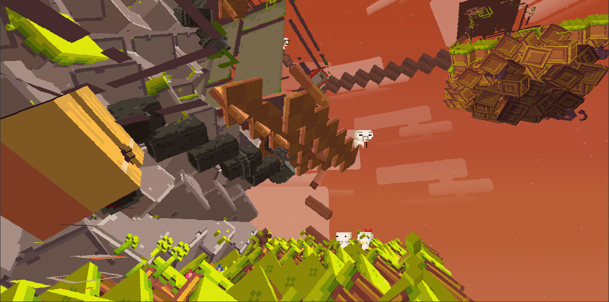

# FEZFX



*The result of messing around with `TrixelEffect` and `InstancedArtObjectEffect` shaders*.

## Overview

This project reconstructs the original DirectX 9.0 effect shaders effects,
converting bytecode back into readable HLSL source code.

## Shaders

See [SHADERS](SHADERS.md) to see the purpose of each shader.

## How to

See [HOWTO](HOWTO.md) for a description of the reconstruction process.

## Compile

Use the `fxc` compiler with the `fx_2_0` profile support:

```cmd
fxc /T fx_2_0 FastBlurEffect.fx /Fo FastBlurEffect.fx.fxc
```

## Testing

1. Download and install [HAT](https://github.com/FEZModding/HAT).

2. Create `Mods/FEZFX` directory and put `Metadata.xml` here.

3. Compile the shader of choice and copy the `.fxc` file to the
   `Mods/FEZFX/Assets/effects/` directory.

4. Run `MONOMODDED_FEZ.exe` or via graphics analyzer with OpenGL support and
   hope that is not crashing on startup 😏 (see for an exception with `Effect`
   class)

## Special Thanks

- [Krzyhau](https://github.com/Krzyhau) - for helping with `FastBlurEffect` shader.

- [FEZUG Mod](https://github.com/FEZModding/FEZUG) - for the wonderful `warp` command.
